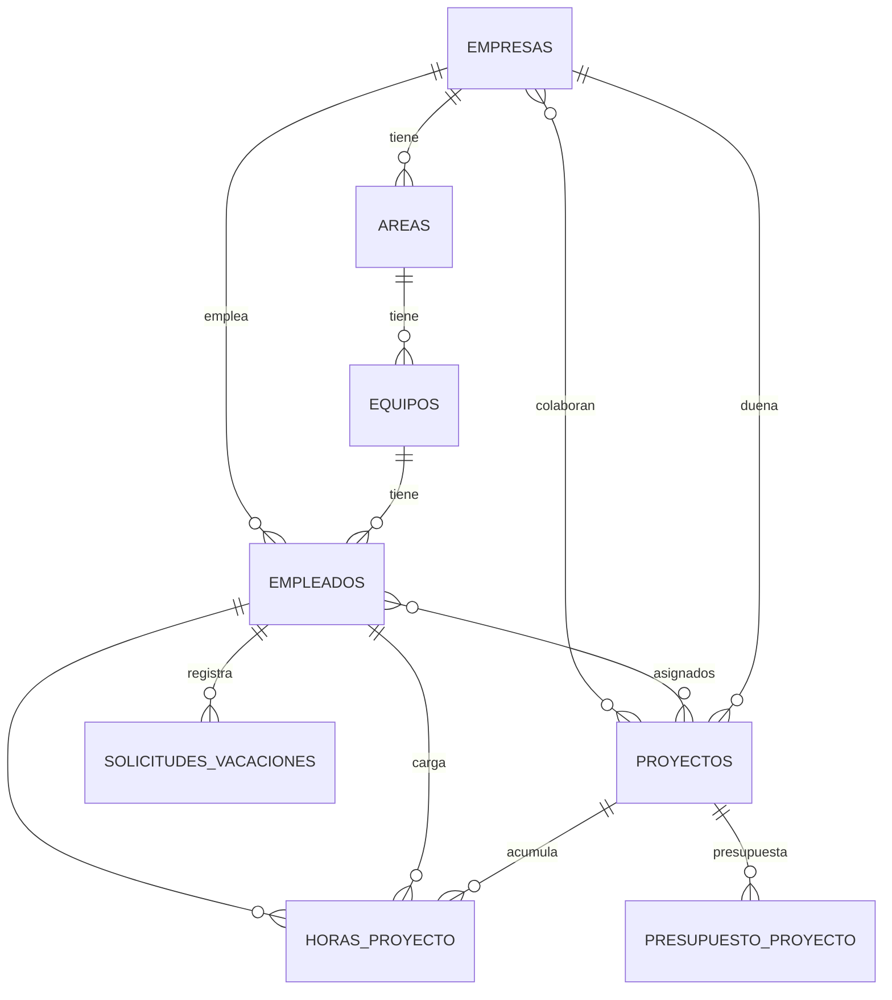

# Modelo de datos — HR Karstec (Sofia)
**Para:** Claude Code · **Estado:** fuente de verdad ÚNICA del schema

> **Regla de precedencia:** si este documento contradice una tabla mencionada en `PLAN_DESARROLLO_AHORA.md` o `PLAN_DESARROLLO_DESPUES.md`, **manda este documento**. Los planes describen el *trabajo*; este describe el *schema*.

---

## 0. Reglas de integridad transversales

- **Multiempresa:** toda tabla de negocio lleva `empresa_id` (uuid, FK a `empresas`). La empresa #1 = "HR Karstec" (la migración inicial vuelca todo lo existente a esa empresa).
- **Empleados no se borran:** se dan de baja por estado (`estado = baja` + `fecha_egreso`). Esto preserva el histórico de costos ("incluye a los que ya no están").
- **Snapshots de costo:** los registros de horas congelan el costo/hora del momento → el costo histórico no se altera si después cambia el sueldo.
- **Auditoría:** trigger `fn_auditoria()` enganchado a cada tabla. `set_updated_at()` para `updated_at`.
- **Catálogos:** vienen con valores de fábrica + permiten crear nuevos.

---

## 1. Núcleo organizativo

```
empresas (1) ──< areas (1) ──< equipos (1) ──< empleados
```

- **empresas** `(id, nombre, activa, created_at, updated_at)`
- **areas** `(id, empresa_id, nombre, ...)` — por empresa.
- **equipos** `(id, empresa_id, area_id, nombre)` — subdivisión de un área. *(nuevo, fase Después)*
- **empleados** `(id, empresa_id, user_id?, area_id, equipo_id?, legajo unique, dni unique, email_corporativo unique, cargo, seniority_id, rol_id, costo_hora?, tipo_contrato, estado, fecha_ingreso, fecha_egreso?, manager_id, ...)`
  - `empresa_id` = empresa de **pertenencia** (la que paga el sueldo). Un empleado pertenece a **una sola** empresa.
  - `dni` = único; es la llave del link público de carga de horas. La importación de nómina lo trae.
  - `costo_hora` = opcional, manual; si está, **pisa** al derivado de nómina (con cartel de advertencia al cambiarlo).
  - `seniority_id` / `rol_id` → migran del actual `nivel`(enum) y `rol`(texto) a catálogos.
- **users** `(id, email, rol, ...)` — operadores de RRHH. El enum `rol (admin_rrhh/management/empleado)` **existe pero no diferencia funcionalidad** (verdicto: roles puramente estructurales). El empleado **no** entra al sistema.

---

## 2. Proyectos y asignaciones *(nuevo, fase Después)*

```
empresas (1) ──< proyectos (dueña)
proyectos (M) >──< empresas        vía proyecto_empresa (colaboradoras)
proyectos (M) >──< empleados       vía empleado_proyecto (asignación)
```

- **proyectos** `(id, empresa_id_duena, nombre, fecha_inicio?, fecha_fin?, estado, ...)`
- **proyecto_empresa** `(proyecto_id, empresa_id)` — **M:N**: empresas colaboradoras del grupo.
- **empleado_proyecto** `(id, empleado_id, proyecto_id, fecha_desde, fecha_hasta?, ...)` — **M:N**: asignación. Define el organigrama por proyecto y qué proyectos le aparecen al empleado en su link de horas. Un empleado puede estar en varios proyectos a la vez; puede tener varios tramos.

**Regla clave:** los cruces entre empresas son **por proyecto**, no por nómina. Un proyecto (de una empresa dueña) puede sumar gente de otras empresas.

---

## 3. Catálogos *(globales, configurables)*

`seniorities`, `roles`, `tipos_ausencia`, `tipos_licencia`, `motivos_baja`, `categorias_capacitacion`.
Patrón común: `(id, nombre, es_predeterminado bool, activo bool, ...)`. Conviven los de fábrica con los nuevos.

---

## 4. Costeo por proyecto *(nuevo, fase Después)*

**Unidad = hora trabajada.** `costo_proyecto = Σ (horas × costo_hora_snapshot)`, acumulado de inicio a fin.

- **horas_proyecto** `(id, empresa_id, empleado_id, area_id, proyecto_id, fecha_trabajada, horas, costo_hora_snapshot, fecha_carga, origen, created_at)`
  - `fecha_trabajada` = día/período que indica el empleado (no la fecha de envío) → imputación correcta en el tiempo.
  - `costo_hora_snapshot` = congelado al cargar.
  - `origen` = `link_publico` | `manual`.
- **Costo/hora efectivo:** `empleados.costo_hora` si existe; si no, derivado de nómina (costo mensual ÷ horas estándar).

**Carga por link público:** formulario sin login → **DNI + área + proyecto + fecha del trabajo + horas**, con **carga múltiple** (varias filas por envío). Patrón técnico: token tipo `assessment_links` + ruta pública que el `AuthMiddleware` deja pasar.

**Métricas que habilita:** costo real · personas (pico / promedio ponderado / total que pasó) · horas totales · comparación entre proyectos similares.

---

## 5. Presupuesto vs. real *(nuevo, fase Después)*

- **presupuesto_proyecto** `(id, empresa_id, proyecto_id, monto_estimado, umbral_aviso_pct?, umbral_sobrepaso_pct?, version, vigente bool, created_at)`
  - **Monto total estimado** (por ahora; la tabla soporta desglose futuro).
  - **Re-estimable con histórico:** cada cambio crea una fila nueva (`version` incremental); la anterior queda con `vigente = false`.
  - **Dos umbrales opcionales** (aviso al acercarse a X% / al superar X%). Si son null → solo se muestra desvío, sin alertas.
- **Real** = Σ de `horas_proyecto` del proyecto. Reporta desvío, % consumido y alertas.

---

## 6. Módulos del ciclo de vida *(portados de Nexio, fase Ahora — todos con `empresa_id`)*

- **solicitudes_vacaciones** `(id, empresa_id, empleado_id, fecha_desde, fecha_hasta, dias, comentario, estado?, [campos de balance preparados], created_at)` — planificada/tomada se derivan por fecha; `cancelada` manual.
- **solicitudes_ausencia** `(id, empresa_id, empleado_id, fecha, tipo_id, motivo, created_at)`.
- **registros_asistencia** `(id, empresa_id, empleado_id, tipo, fecha, hora_entrada, hora_salida, metodo, created_at)`.
- **capacitaciones** + **empleado_capacitacion** `(estado, categoria_id, ...)`.
- **evaluaciones_desempeno** *(tabla nueva, NO reutilizar `assessment_*`)* — lógica de scoring portada de Nexio.

---

## 7. Skills · Días especiales *(fase Después)*

- **skills** `(id, nombre)` + **empleado_skills** `(empleado_id, skill_id, nivel)`.
- **dias_especiales** / **calendario_laboral** `(id, empresa_id, fecha, tipo, descripcion)` — feriados, cumpleaños, días off; lo consumen vacaciones/ausencias/asistencia para días hábiles.

---

## 8. Permisos y usuarios *(fase Después, al final)*

- **acceso_empresa** `(usuario_id, empresa_id, habilitado)` — qué empresas ve cada operador.
- **acceso_seccion** `(usuario_id, seccion, habilitado)` — on/off por sección (sin niveles ver/editar).
- Reglas: todos arrancan full · cada uno edita el acceso de los **demás, no el propio** · la sección "Accesos" no se apaga · todos crean usuarios.
- Alta de usuario: mail + contraseña genérica + **cambio obligatorio al primer ingreso** + recuperación de contraseña (letras y números).
- Cada módulo registra un **identificador de sección estable** (`vacaciones`, `ausencias`, ...) desde que se crea, para que esta capa sea plug-and-play.

---

## 9. Links públicos *(patrón general)*

Base: token + ruta pública sin auth (estilo `assessment_links`). Primer uso = carga de horas. Generalizable a otros formularios que alimenten la base.

---

## 10. Diagrama de relaciones (resumen)



> El costo de un proyecto se lee como: `PROYECTOS → EMPLEADO_PROYECTO (quién) → HORAS_PROYECTO (cuánto) → costo`, y se contrasta contra `PRESUPUESTO_PROYECTO`.
